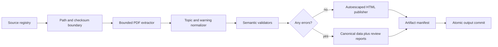

# Architecture

## Goal

Turn an approved set of technical PDFs into a canonical content layer and accessible static site
without silently losing source content. The implementation favors explicit contracts and
deterministic rules over opaque inference.

## Data flow

## Stage contracts

### Registry boundary

`SourceRegistry` rejects unknown fields and duplicate IDs. `SourceSpec` rejects absolute paths and
parent traversal before filesystem access. Resolution follows symlinks and then verifies that the
result remains under the registry directory. Optional SHA-256 values bind a run to reviewed bytes.

### Extraction

`PdfExtractor` accepts a resolved PDF path, typed metadata, and a precomputed checksum. It bounds
file size, page count, and raw blocks per page. Text is ordered with PyMuPDF's sorted extraction;
ruled tables use table detection; images become location-preserving review placeholders. PDF
actions, attachments, scripts, and links are never executed.

For `p` pages, `b` blocks, and table-detection work `t`, extraction is approximately
`O(p * (b + t))`. File hashing is `O(n)` time and `O(1 MiB)` memory for `n` input bytes.

### Normalization

Level-one and level-two headings start topics. Topic IDs combine the source ID with a bounded ASCII
slug; repeated headings receive deterministic numeric suffixes. Title terms conservatively assign
concept, task, reference, or troubleshooting types.

Safety notices are publishable only when source text explicitly includes severity, condition,
consequence, and avoidance. The parser reports missing fields instead of synthesizing them.
Normalization is `O(b)` expected time and memory.

### Validation and publication gate

Validators check duplicate IDs, empty topics, missing image alternatives, missing table headers,
and irregular table widths. Error findings block HTML. Warnings document required human attention
without hiding otherwise reviewable output.

### Output transaction

Every stage writes to a randomly named sibling staging directory. A complete build receives a
SHA-256 manifest and is moved into place with `os.replace`. Existing destinations are protected
unless the caller supplies `--overwrite`, and even then replacement requires a valid versioned
Foundry manifest. Broad locations such as the home, current, or filesystem root are rejected.

## Determinism

- No timestamps or random identifiers enter canonical artifacts.
- Sources, topics, issues, files, and JSON keys use stable sorting.
- Build identity hashes ordered pairs of source IDs and content digests.
- Templates are in-memory versioned source, use strict variables, and autoescape HTML.
- The integration suite compares every output byte across independent runs.

## Module boundaries

Dependencies point inward toward `models.py`; stages do not mutate each other's values. The CLI is
thin, and the pipeline is the only orchestration layer. This reduces hidden coupling and lets tests
replace filesystem inputs without mocking internal implementation details.

## Extension points

Likely future adapters include OCR extraction, SVG/diagram handling, schema-aware authoring output,
and SQLite provenance queries. Each should implement the existing typed stage contracts and add a
contract test before changing orchestration.
